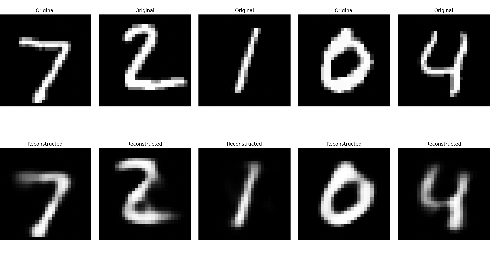

# Sparse AutoGrad: A Custom Automatic Differentiation Library

A from-scratch implementation of automatic differentiation with sparse training capabilities, featuring a complete neural network framework including optimizers, loss functions, and autoencoder training on MNIST.



## Motivation

Understanding how deep learning frameworks work under the hood is crucial for both learning and research. This project implements automatic differentiation from first principles, providing insights into:

- **Computational Graph Construction**: How operations are tracked and gradients are computed
- **Backpropagation**: The core algorithm that enables neural network training
- **Sparse Training**: Implementing KL divergence-based sparsity constraints for more efficient representations
- **Optimizer Implementation**: Building SGD, Adam, and other optimizers from scratch

By building these components from the ground up, we gain deep understanding of the mathematical foundations and implementation details that power modern deep learning frameworks like PyTorch and TensorFlow.

## Implementation Details

### Core Components

#### Tensor Class
The foundation of the system is the `Tensor` class that wraps NumPy arrays and tracks computation history:

```python
class Tensor:
    def __init__(self, data: np.ndarray, op: Optional[Any] = None):
        self.data = data
        self.grad = None
        self._op = op  # Operation that created this tensor
```

#### Automatic Differentiation
- **Topological Sorting**: Uses DFS to build computation graph ordering
- **Gradient Accumulation**: Properly handles multiple paths in computation graphs
- **Operation Tracking**: Each tensor remembers the operation that created it

#### Operations
Implemented a complete set of differentiable operations:
- **Basic Math**: Add, Subtract, Multiply, Divide
- **Linear Algebra**: Matrix Multiplication, Transpose, Reshape
- **Activation Functions**: ReLU, Sigmoid, Tanh
- **Reduction Operations**: Sum, Mean
- **Loss Functions**: MSE, BCE, KL Divergence

#### Neural Network Modules
- **Linear Layers**: Fully connected layers with Xavier initialization
- **Sequential**: Container for stacking multiple layers
- **AutoEncoder**: Complete encoder-decoder architecture

#### Optimizers
- **Gradient Descent (GD)**: Basic gradient descent
- **Stochastic Gradient Descent (SGD)**: Mini-batch training
- **Adam**: Adaptive learning rates with momentum

### Sparse Training Implementation

The project implements sparse autoencoder training using KL divergence:

```python
# KL divergence for sparsity constraint
kl_loss = KLDiv.apply(z, sparsity)
total_loss = recon_loss + beta * kl_loss
```

This encourages the hidden layer activations to be sparse, leading to more efficient representations.

## Training

### Prerequisites
```bash
pip install numpy matplotlib keras
```

### Running the Training

1. **Basic Training**: Train a sparse autoencoder on MNIST
```bash
python train.py
```

2. **Key Parameters** (configurable in `train.py`):
   - `HIDDEN_DIM = 64`: Size of the bottleneck layer
   - `EPOCHS = 50`: Number of training epochs
   - `BATCH_SIZE = 32`: Mini-batch size
   - `sparsity = 0.10`: Target sparsity level
   - `beta = 0.1`: Sparsity penalty weight

3. **Training Features**:
   - Learning rate decay from 0.01 to 0.001
   - Adam optimizer with adaptive learning rates
   - Real-time loss plotting
   - Gradient tracking and visualization
   - Performance timing

### Example Usage

```python
from tensor import Tensor
from module import AutoEncoder
from operations.loss import MSELoss

# Create model
model = AutoEncoder(input_dim=784, hidden_dim=64)

# Forward pass
x = Tensor(input_data)
output = model(x)

# Compute loss and gradients
loss = MSELoss.apply(x, output)
loss.backward()

# Update parameters
optimizer.step()
model.zero_grad()
```

## Sample Image

The sample image above shows the results of training a sparse autoencoder on MNIST digits. The top row displays original images, while the bottom row shows the reconstructed outputs. The sparse training encourages the model to learn efficient, compressed representations while maintaining reconstruction quality.

### Key Results
- **Compression**: 784 → 64 → 784 (12.25x compression ratio)
- **Sparsity**: Hidden layer activations are encouraged to be 90% sparse
- **Quality**: Maintains good reconstruction quality despite high compression
- **Efficiency**: Sparse representations enable faster inference and better generalization. Adam results in 10-fold convergance.

---

